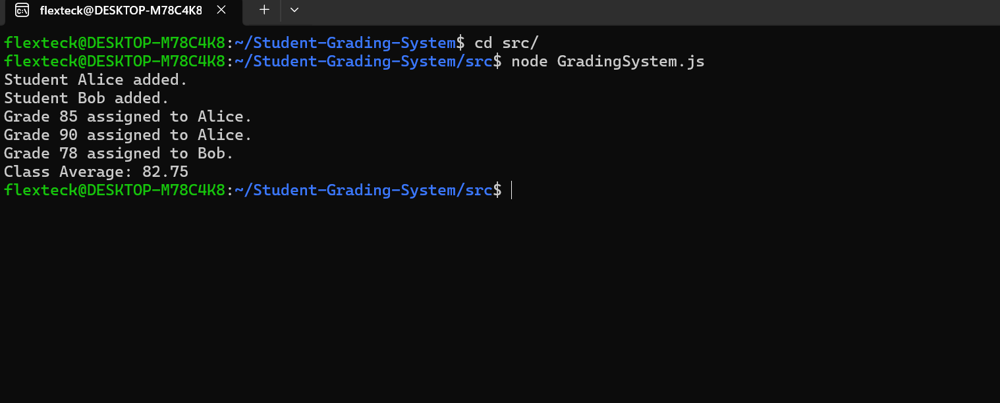

# Student Grading System

## Problem Domain Description
The **Student Grading System** is a simple application that manages students and their grades for a course. It allows users to:
- Add students to the system.
- Assign grades to specific students.
- Calculate the average grade of the entire class.
- Display information about students and their grades.

This system is implemented using JavaScript and is designed to be easy to understand and extend.

---

## Class Diagram
The system is designed with two main classes:

1. **Student**
   - Attributes:
     - `name`: The name of the student.
     - `id`: A unique identifier for the student.
     - `grades`: An array of grades assigned to the student.
   - Methods:
     - `addGrade(grade)`: Adds a grade to the student's record.
     - `calculateAverage()`: Calculates the average of the student's grades.

2. **GradingSystem**
   - Attributes:
     - `students`: A list of students managed by the system.
   - Methods:
     - `addStudent(name, id)`: Adds a new student to the system.
     - `assignGrade(studentId, grade)`: Assigns a grade to a specific student.
     - `getClassAverage()`: Calculates the average grade for all students in the system.

**UML Class Diagram:**


---

## Flowchart
The flow of operations in the Student Grading System is represented as a flowchart for better understanding of the process.

**Flowchart Diagram:**
# Flowchart: Student Grading System

```mermaid
graph TD
    Start["Start"] --> AddStudent["Add a new student?"]
    AddStudent -- "Yes" --> EnterStudent["Enter student name and ID"]
    AddStudent -- "No" --> AssignGrade["Assign grade to a student?"]
    EnterStudent --> AssignGrade
    AssignGrade -- "Yes" --> EnterGrade["Enter student ID and grade"]
    EnterGrade --> StudentFound{"Is student found?"}
    StudentFound -- "Yes" --> AddGrade["Add grade to the student's record"]
    StudentFound -- "No" --> Error["Display error: Student not found"]
    AddGrade --> CalculateAvg["Calculate class average"]
    Error --> CalculateAvg
    AssignGrade -- "No" --> CalculateAvg
    CalculateAvg --> DisplayResults["Show class average and student details"]
    DisplayResults --> End["End"]


---

## Code Implementation
The system is implemented in JavaScript and consists of two main files:

1. `Student.js`
2. `GradingSystem.js`

The source code is located in the `src` folder. To run the program:

1. Navigate to the `src` folder.
2. Execute the following command using Node.js:
   ```bash
   node GradingSystem.js
   ```

---

## Optional: Screenshots
To provide a visual representation of the program's execution, include screenshots of the console output:

**Execution Output:**


---

## Repository Structure
```
Student-Grading-System/
├── README.md
├── UML-Diagram/
│   ├── class-diagram.png
│   ├── flowchart-diagram.png
├── src/
│   ├── Student.js
│   ├── GradingSystem.js
└── screenshots/
    ├── execution-output.png
```


